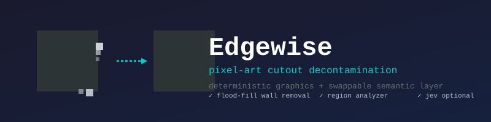
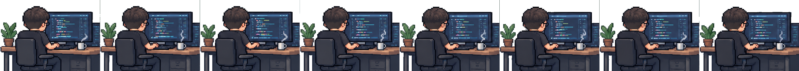

# Edgewise

**Pixel-art cutout decontamination.** Removes the wall-color halo left on transparent PNG edges when you export sprites from tools like Aseprite.

---

## The problem

When you export a transparent sprite from Aseprite on a solid wall background, the edges don't just become transparent — they **bleed** the wall color into the sprite's own pixels. That halo looks fine on a solid background, but the moment you put the sprite on anything else, you see a faint colored fringe.

Edgewise fixes that.

## The result

| Before | After |
|---|---|
|  |  |

The wall color is gone. The subject pixels are intact. The edges are clean.

---

## How it works

Three layers, cleanly separated:

```
Layer 1 — Graphics (deterministic · packages/core)
  flood-fill wall removal · edge detection · nearest-interior lookup
  connected components · region analyzer · confidence engine
        │  CandidateRegion[]
        ▼
Layer 2 — Semantic (packages/semantic · optional)
  region → model verdict → KEEP | REMOVE | UNCERTAIN
  (current backend: Jev / TypeSafe System One)
        │  {region: decision}
        ▼
Layer 3 — Runtime (apps/)
  apps/cli   : Python CLI — what ships today
  apps/web   : browser demo (WASM) — planned
```

**Why the split?** Layer 1 is pure numpy/scipy — deterministic, unit-testable, portable to WASM/WebGPU. Layer 2 is the only "judgment call", and you can swap Jev for a different model without touching the graphics code.

Run with `--skip-jev` for a fully rules-only pipeline.

---

## Quick start

```bash
uv sync
uv run edgewise --help
```

Or with plain pip:

```bash
pip install -e packages/types -e packages/core -e packages/semantic -e apps/cli
```

### Cutout a frame

```bash
# Opaque RGB frame → transparent PNG with clean edges
edgewise cutout input_dir/ output_dir/ --skip-jev
```

### Rebuild sprite sheet

```bash
# Stitch cleaned frames into a horizontal sheet
edgewise rebuild --config examples/desk8/desk8.json --sheet-only
```

### Desk8 example

```bash
edgewise cutout  --config examples/desk8/desk8.json --skip-jev
edgewise rebuild --config examples/desk8/desk8.json
```

---

## What it does and doesn't do

| Does | Doesn't |
|---|---|
| Remove wall-color halo on transparent sprites | Extract people from photos |
| Clean pixel-art / hand-drawn cutout edges | Semantic segmentation of complex scenes |
| Run deterministic without any API key | Handle multi-tone gradient backgrounds |
| Work with or without a semantic model | Process video or real-time streams |

Edgewise is built for **sprites and cutout assets** — not general-purpose background removal.

---

## Repository layout

```
edgewise/
├── packages/
│   ├── core/                  # Layer 1 — deterministic graphics
│   │   └── edgewise_core/
│   │       ├── pixel/         # color math (HSL, luminance, distance, blending)
│   │       ├── edge/          # edge detection, local background, boundary sampling
│   │       ├── mask/          # morphology / flood-fill / trapped background
│   │       └── segmentation/ # region analyzer, confidence engine
│   ├── semantic/              # Layer 2 — swappable semantic backends
│   │   └── edgewise_semantic/
│   │       ├── protocol.py    # SemanticReviewer contract
│   │       └── jev/           # Jev adapter (TypeSafe System One)
│   ├── types/                 # shared contracts (candidates, params, decisions)
│   └── wasm/                  # WASM build of Layer 1 — planned
├── apps/
│   ├── cli/                   # cutout + rebuild commands
│   └── web/                   # browser demo — planned
└── examples/
    ├── desk8/                 # 8-frame developer-at-desk animation
    └── favicon/               # hand-drawn Y letter test
```

---

## Security

The Jev adapter reads the API key from the `TYPESAFE_API_KEY` environment variable. Keys are never stored in the repository. If you fork this project and find a key in older history, treat it as compromised and rotate it.

---

## Roadmap

- pytest coverage for Layer 1 and the rule engine
- Jev Region Review — pass UNCERTAIN regions to the semantic model
- Narrow Gap Detection — 1-3px inter-object gap detection
- WASM/WebGPU runtime for Layer 1, browser demo in `apps/web`
- additional semantic backends (local heuristics, CLIP-style models) behind the same `SemanticReviewer` protocol

---

## License

MIT © 2026 Yao
